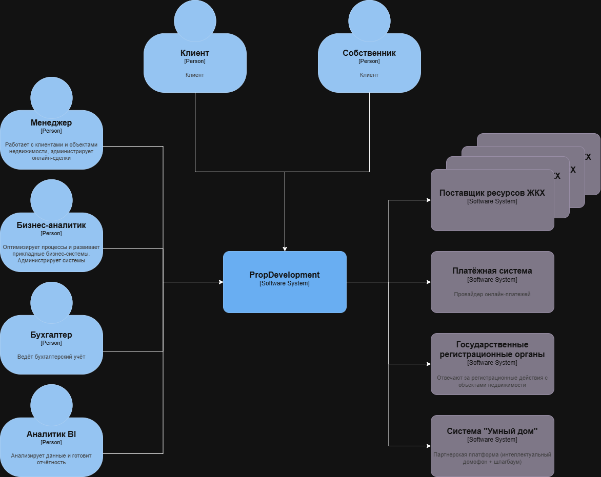
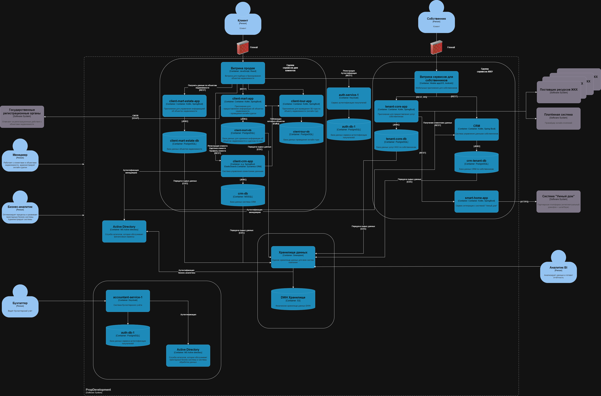

**Контекст**

**Контейнеры**

# Требования к внешней интеграции

## Требования к безопасности

* Все персональные данные должны передаваться в зашифрованном виде
* Все действия должны журналироваться с необходимым набором данных
* При взаимодействии с внешним сервисом использовать минимальный набор необходимых данных

##  Протоколы аутентификации и авторизации

* Протокол TLS 1.2 или выше
* Аутентификация и авторизация на основании JWT токенов по аналогии с остальными сервисами (OAuth 2.0)

## Взаимодействие между системами и внешней платформой

* Взаимодействие с внутренними сервисами - через REST API. В заголовках HTTP запроса должен быть JWT токен.
* Взаимодействие с партнерской платформой - через HTTPS (TLS >= 1.2).
* Данные (биометрия, номера) до передачи партнеру шифруются, необходима периодическая синхронизация ключей с партнером.